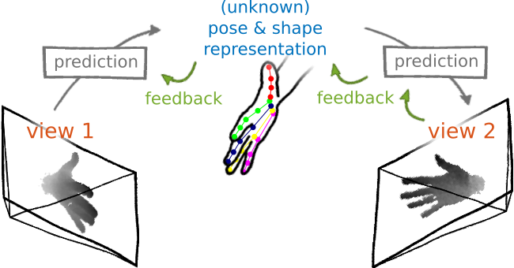
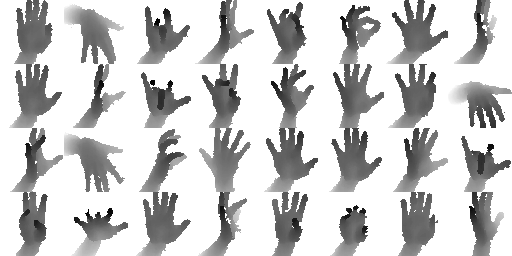
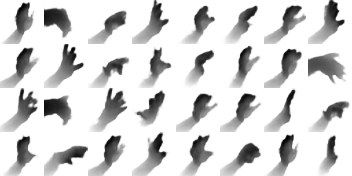
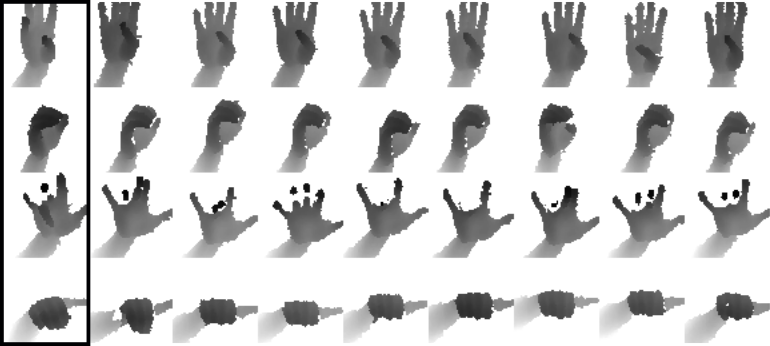
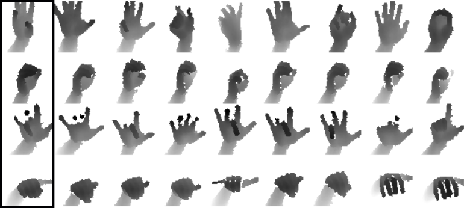
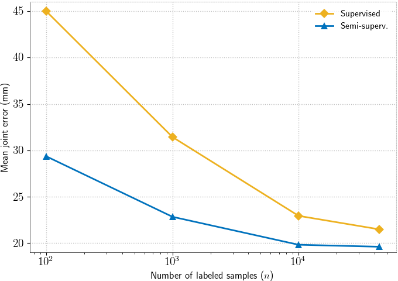

This site is intended to provide code and additional material along with our CVPR 2018 paper 

<h2><center>Learning Pose Specific Representations by Predicting Different Views</center></h2>

<p>
<center><a href="https://poier.github.io">Georg Poier</a>&nbsp;&nbsp;&nbsp;&nbsp;&nbsp;
<a href="https://www.tugraz.at/institute/icg/research/team-bischof/lrs/people/schinagl">David Schinagl</a>&nbsp;&nbsp;&nbsp;&nbsp;&nbsp;
<a href="https://www.tugraz.at/institute/icg/research/team-bischof/people/team-about/horst-bischof">Horst Bischof</a></center>
</p>

<center>Graz University of Technology</center>  
<center>Austria</center>

<p>
<center>
<a href="./documents/poier2018cvpr_preview.pdf">[Paper (pdf)]</a>&nbsp;&nbsp;&nbsp;&nbsp;
<a href="./documents/poier2018cvpr_preview_supplemental.pdf">[Supplemental (pdf)]</a>&nbsp;&nbsp;&nbsp;&nbsp;
<a href="">[Code+Data (coming soon)]</a>
</center>
</p>


Some excerpts and results from the paper:

### Sketch for learning a pose specific representation from unlabeled data


We learn to predict a low-dimensional latent representation and, subsequently,
a different view of the input, 
*solely* from the latent representation.
The error of the view prediction is used as feedback,
enforcing the latent representation to capture pose specific information
without requiring labeled data.


### Abstract
The labeled data required to learn pose estimation for articulated objects 
is difficult to provide in the desired quantity, 
realism, density, and accuracy.
To address this issue, we develop a method to learn representations, 
which are very specific for articulated poses, without the need for labeled training data.
We exploit the observation that the object pose of a known object
is predictive for the appearance in any known view.
That is, given only the pose and shape parameters of a hand, 
the hand's appearance from any viewpoint can be approximated.
To exploit this observation, we train a model that -- given input from one view -- 
estimates a latent representation, which is trained to be predictive
for the appearance of the object when captured from another viewpoint.
Thus, the only necessary supervision is the second view.
The training process of this model reveals an implicit pose representation in the 
latent space.
Importantly, at test time the pose representation can be inferred using only a single view.
In qualitative and quantitative experiments we show that the learned representations
capture detailed pose information.
Moreover, when training the proposed method jointly with labeled and unlabeled data, 
it consistently surpasses the performance of its fully supervised counterpart,
while reducing the amount of needed labeled samples by at least one order of magnitude.


### Results

#### View Predictions
Examples for generated views from the NYU validation set 
(*i.e.*, the results of our "proxy task").

Input views:

 

and the corresponding predictions from our method 
(images with same grid index are corresponding):



#### Analysis of the latent representation
The actual intention of our method is that the training process reveals 
a latent representation, which captures the pose of the hand.
One possibility to analyze the latent representation is to visualize 
the nearest neighbors in the latent space. 
In the following image query samples are shown in the marked leftmost column
and the eight nearest neighbors of each query are shown in the same row:



Below we show the nearest neighbors in the latent space when 
**learned with an autoencoder (instead of our method)** for comparison:



#### Ablation experiments
We compare the error of purely supervised training with the error of our method 
(*Semi-superv.*) when trained with different numbers of labeled samples:



See more results in the paper and supplemental material.


### Citation
If you can make use of this work, please cite:

Learning Pose Specific Representations by Predicting Different Views.  
Georg Poier, David Schinagl and Horst Bischof.  
In *Proc. CVPR* (to be published), 2018.

Bibtex:
```
@inproceedings{Poier2018cvpr_preview,  
  author = {Georg Poier and David Schinagl and Horst Bischof},  
  title = {Learning Pose Specific Representations by Predicting Different Views},  
  booktitle = {{Proc. IEEE/CVF Conf. on Computer Vision and Pattern Recognition (CVPR)}},  
  note = {(to be published)},  
  year = {2018}
}
```


### Acknowledgements
We thank the anonymous reviewers for their effort and valuable feedback, 
Samuel Schulter, Peter Roth, Michael Opitz and Horst Possegger 
for feedback on an early draft of this manuscript, 
Martin Oswald, Andreas Bean and colleagues at IGT Unterpremstätten 
for the fruitful cooperation and lending their hands for the dataset, and
Anna Micheler-Hofer, Stefan Ainetter and Florian Ziessler 
for manually labeling hand poses.
We also thank NVIDIA Corporation for awarding a Titan Xp GPU 
without which less experiments would have been possible.


